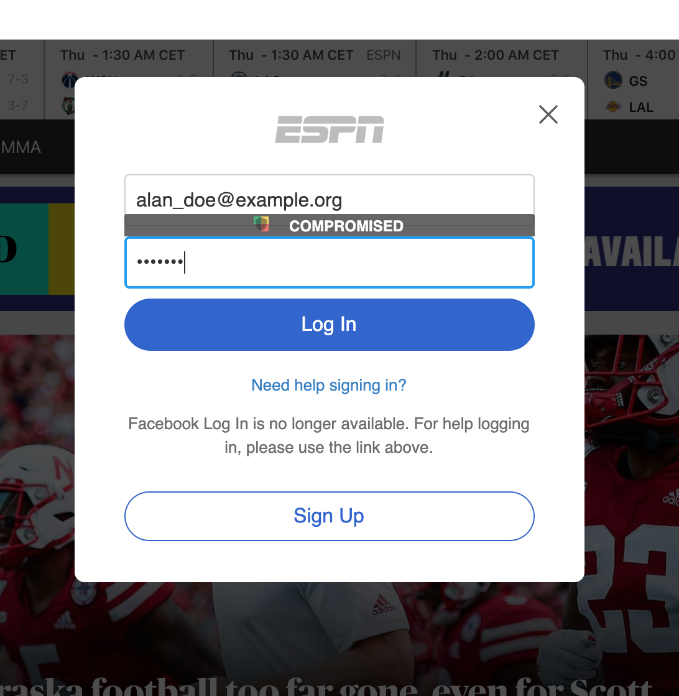

# kol

This is a pretty simple WebExtension for Google Chrome adding a strength indicator to all password fields. The indicator is based on [zxcvbn-pv](https://github.com/therealglazou/zxcvbn-pv), a rewrite and extension of the original Dropbox's [zxcvbn](https://github.com/dropbox/zxcvbn) under MIT license. Zxcvbn-pv is itself calling zxcvbn *and* Troy Hunt's [HaveIBeenPwned](https://haveibeenpwned.com/Passwords) Pwned Passwords API.

The code is released under [MPL 2.0](./LICENSE).

## Install and build

First clone this repo:

    git clone https://github.com/therealglazou/kol

Then clone the zxcvbn-pv repo inside the newly created directory:

    cd kol/src
    git clone https://github.com/therealglazou/zxcvbn-pv

You can now install the extension as "unpackaged" into Chrome. Use Window>Extensions, turn on "Developer mode" at the top-right and then use the "Load unpacked" button to select the `kol` directory. If you want to build an official signed extension, that's another story and not the purpose of this repo, I did this only for fun during a night without sleep.

## In Web pages

All password fields (if not empty) will show a visual hint above the field indicating the "strength" of the password. Yes, I do know that "strength" does not really mean anything here but that's the easiest word we can use for non-geeks. The visual hint is localized into en-US and fr-FR. You can trivially add your own locale adding a directory and a file into the `_locales` directory.

- **Compromised**: the password/passphrase in the input field is reported as leaked by HaveIBeenPwned. Change it. Now.
- **Very weak**: the password/passphrase in the input field can be far too easily found by a bruteforce, dictionary or keyboard layout attack. Pick a much stronger password/passphrase.
- **Weak**: the password/passphrase in the input field is not complex enough and can be found by a bruteforce, dictionary or keyboard layout attack. Pick a stronger password/passphrase.
- **Good**: the "strength" of your password/passphrase is acceptable (for now).

Screenshot:

## Releases

- 0.1 initial release. Adds a visual indicator to password fields based on zxcvbn and haveIBeenPwned
